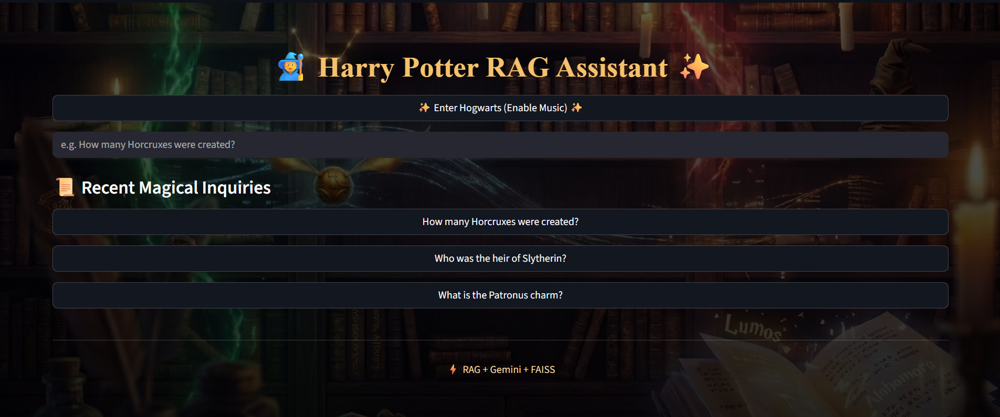

# 🧙 Harry Potter RAG Assistant

> **A production-ready Retrieval-Augmented Generation (RAG) application built over the complete Harry Potter book series using FAISS, Gemini LLM, and Streamlit.**

---

## 📸 Application Preview

> **Screenshot placeholder**
> *(Add a screenshot or GIF of the app UI here)*

```

```

---

## 🌐 Live Demo (Deployed)

👉 **Streamlit App:**
[https://harry-potter-rag-kbjs7ycdty2jcprgwscbfq.streamlit.app](https://harry-potter-rag-kbjs7ycdty2jcprgwscbfq.streamlit.app)

---

## 🧠 Project Overview

This project is an **end-to-end RAG system** that allows users to ask questions across all **7 Harry Potter books**, with answers generated **strictly from retrieved book context**.

The focus of this project is **system design, retrieval quality, grounding, and real-world deployment challenges**, not just calling an LLM API.

---

## 🔧 Architecture

```
User Query
   ↓
Retriever (FAISS per-book indices)
   ↓
Context Filtering + Ranking
   ↓
Prompt Construction
   ↓
Gemini LLM (gemini-2.5-flash)
   ↓
Grounded Answer + Sources
```

---

## 🗂️ Vector Store Design

* Each book is indexed **independently**
* FAISS indices stored per book:

  ```
  vector_store/
    ├── harry_potter_and_the_sorcerers_stone/
    ├── harry_potter_and_the_chamber_of_secrets/
    ├── harry_potter_and_the_prisoner_of_azkaban/
    ├── harry_potter_and_the_goblet_of_fire/
    ├── harry_potter_and_the_order_of_the_phoenix/
    ├── harry_potter_and_the_half_blood_prince/
    └── harry_potter_and_the_deathly_hallows/
  ```
* Each folder contains:

  * `index.faiss` — vector index
  * `meta.pkl` — metadata (book, chapter, chunk text)

This makes the system:

* easier to debug
* scalable
* less prone to retrieval noise

---

## 🎨 Frontend & UX (Streamlit)

### Key UX Features

* Custom **Harry Potter–themed UI** using CSS
* ✨ **“Enter Hogwarts” button** to enable background music
* 🎵 **Background music (Hedwig’s Theme)**

  * Implemented in a browser-policy-compliant way
* 🔊 **Spell sound effect on every generated answer**
* Session-safe handling of reruns and audio playback
* Displays **answer + source chapters**

This project intentionally explores **real deployment UX challenges**, especially browser audio restrictions.

---

## 🧠 LLM & Prompting

* **Model:** `gemini-2.5-flash`
* Answers are **forced to be grounded** in retrieved context
* If context is insufficient, the model responds with *“Not found in the book”*
* Prevents hallucination-heavy behavior

---

## ⚠️ Important Note — Gemini API Quota

This project uses the **free-tier Gemini API**, which has a **strict daily request limit (~20 requests)**.

If you encounter an error like:

```
Gemini error: 429 RESOURCE_EXHAUSTED
You exceeded your current quota.
```

👉 Please wait a few hours and try again.
This is an **API quota limitation**, not an issue with the application or deployment.

---

## 🛠️ Tech Stack

* **Python**
* **FAISS** — vector search
* **Gemini LLM** — text generation
* **Streamlit** — frontend & deployment
* **PyMuPDF / PyPDF** — PDF parsing
* **Sentence Transformers** — embeddings

---

## 📁 Project Structure

```
harry_potter_rag/
│
├── assets/                # Images, background, audio
├── data/                  # Harry Potter PDF
├── ingestion/             # PDF loading, chunking, indexing
├── rag/                   # Retriever, prompt, Gemini client
├── vector_store/          # FAISS indices (per book)
├── streamlit_app.py       # Main application
├── requirements.txt
└── .env                   # API keys (ignored in git)
```

---

## 🚀 Run Locally

### 1️⃣ Clone the repository

```bash
git clone https://github.com/MeetJani0/harry-potter-rag.git
cd harry-potter-rag
```

### 2️⃣ Create virtual environment

```bash
python -m venv hp_rag
source hp_rag/bin/activate  # Windows: hp_rag\Scripts\activate
```

### 3️⃣ Install dependencies

```bash
pip install -r requirements.txt
```

### 4️⃣ Set environment variable

Create a `.env` file:

```env
GEMINI_API_KEY=your_api_key_here
```

### 5️⃣ Run the app

```bash
streamlit run streamlit_app.py
```

---

## 🎯 Key Learnings

* Designing **hallucination-resistant RAG pipelines**
* Managing **audio + browser autoplay policies**
* Differences between **local vs cloud Streamlit behavior**
* Importance of **index granularity** in vector search
* Building GenAI systems that **work outside notebooks**

---

## 📌 Future Improvements

* Hybrid retrieval (BM25 + vectors)
* Streaming token output
* Multi-turn conversation memory
* Paid-tier LLM fallback
* Citation highlighting per sentence

---

## 👋 About Me

Built as part of my learning and exploration in **AI Engineering, LLM systems, and applied GenAI product development**.

If you find this interesting, feel free to ⭐ the repo or reach out.

---